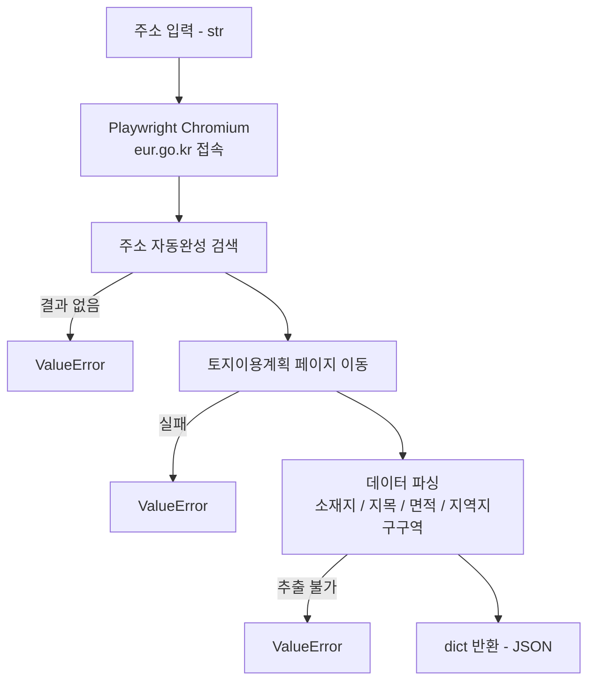

# 토지이용계획 스크래퍼 PRD

## 1. 제품 개요

- **목적**: 토지이음(eum.go.kr)에서 주소 기반 토지이용계획 정보를 자동으로 수집
- **배경**: 반복적인 수동 사이트 조회를 자동화하여 업무 시간 단축
- **주요 사용자**: 부동산·건축 업무 담당자

---

## 2. 기술 스택

| 항목 | 내용 |
|------|------|
| 언어 | Python 3.x |
| 브라우저 자동화 | Playwright (sync API) + Chromium |
| 의존성 관리 | venv (`playwright>=1.40.0`) |
| 인코딩 | UTF-8 (Windows cp949 환경 대응) |
| 대상 사이트 | 토지이음 (eum.go.kr) |

---

## 3. 아키텍처



- 진입점: `get_land_use_info(address, headless=True)`
- 동기(sync) 방식 고정 — async 전환 금지

---

## 4. 사용 시나리오

| 시나리오 | 설명 |
|----------|------|
| 단일 조회 | 주소 1건 입력 → JSON 반환 |
| (예정) 배치 조회 | 주소 리스트 입력 → 일괄 처리 |

---

## 5. 기능 요구사항

### 입력
- 한국 도로명 또는 지번 주소 문자열 (예: `강남구 테헤란로 152`)

### 출력 (JSON)
```json
{
  "address": "입력 주소",
  "소재지": "서울특별시 강남구 역삼동 737번지",
  "지목": "대",
  "면적": "13,156.7 ㎡",
  "지역지구구역": [
    {"구분": "국토계획법",        "지역지구구역명": "도시지역"},
    {"구분": "다른법령",          "지역지구구역명": "가로구역별 최고높이 제한지역<건축법>"},
    {"구분": "토지이용규제기본법", "지역지구구역명": "토지거래계약에관한허가구역(...)"}
  ]
}
```

### 에러 처리
- 주소 자동완성 결과 없음 → `ValueError`
- 토지이용계획 페이지 이동 실패 → `ValueError`
- 데이터 추출 불가 → `ValueError`

### 공개 API
- `get_land_use_info(address: str, headless: bool = True) -> dict`
- **시그니처 변경 금지**

---

## 6. 비기능 요구사항

| 항목 | 요구사항 |
|------|----------|
| 신뢰성 | 셀렉터 변경 전 반드시 `headless=False`로 실제 브라우저 검증 |
| 인코딩 | Windows 환경(cp949)에서 UTF-8 출력 보장 |
| 의존성 격리 | `venv/` 내부에만 패키지 설치 (`playwright>=1.40.0`, Chromium) |
| 동기 방식 유지 | Playwright sync API 사용. async 전환 금지 |

---

## 7. Claude 행동 규칙

- 요구사항이 불명확하거나 접근 방식이 여러 가지일 때, 일방적으로 가정하고 진행하지 말고 **인터뷰 형태로 선택지를 제시하며 질문할 것. (텍스트가 아닌 선택할 수 있게 카드 형태로 인터뷰 할 것)**

---

## 8. 개발 워크플로우

**핵심 루프**: 작은 변경 → 테스트 → 린트 → 커밋 → 반복

1. 기능 하나 추가
2. 테스트 돌려서 확인
3. 린트/포맷 체크
4. 문제 없으면 커밋
5. 다음 기능으로 넘어가기

> 이렇게 하면 문제가 생겨도 **마지막 커밋**으로 돌아가면 되니까, 디버깅이 훨씬 쉬워집니다.